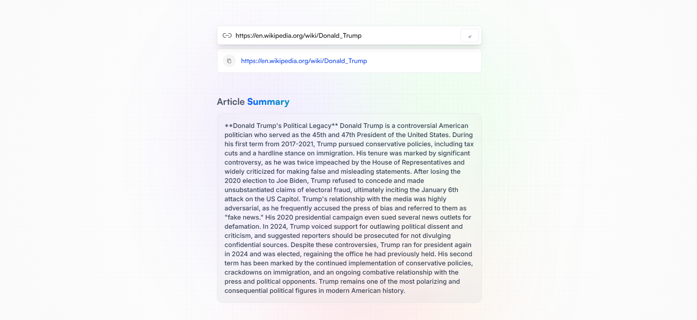

  <h1 align="center">Portfolio Clone Coding</h1>
  

    
    
    
  

   

  

    This repository is based on tutorial by 
    <a href="https://www.youtube.com/@javascriptmastery" target="_blank">JavaScript Mastery</a>  
    <a href="https://www.youtube.com/watch?v=vpvtZZi5ZWk" target="_blank">Turning Your AI Application into a Profitable SaaS Business</a>
  

   

  
  
page

   

  
  
sample usage

